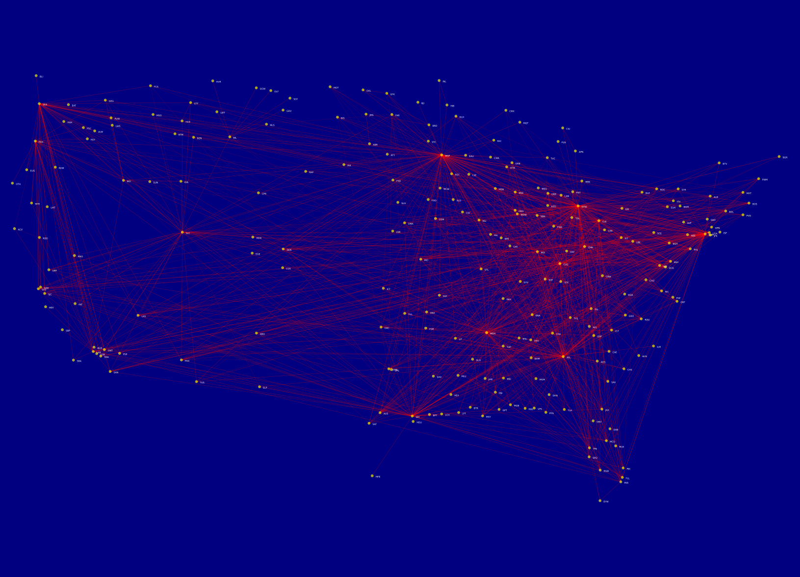
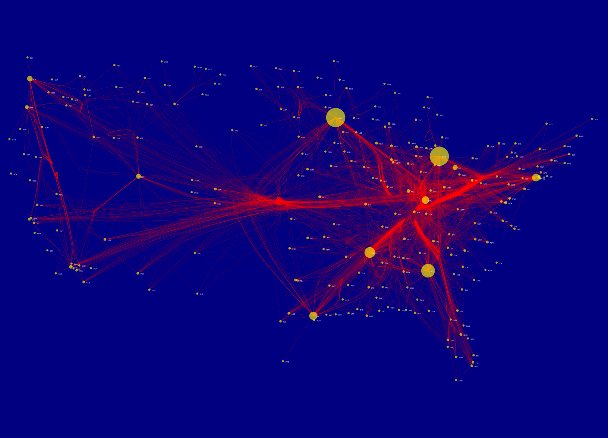

# Visualization of airline travel in the USA

Semester work for the B4M39VIZ class done by Adam Černý and Stanislav Lamoš.

## Description

Implemented Force-Directed Edge Bundling (FDEB) for visualization of the airline data. You can read about our approach and implementation in the attached [`report`](main.py).


## Usage
To compile the code and display the visualization, run the following command: 
```shell
make build
```

## Initial State (only applying Mercator projection)
 
## Our Visualisation 
 